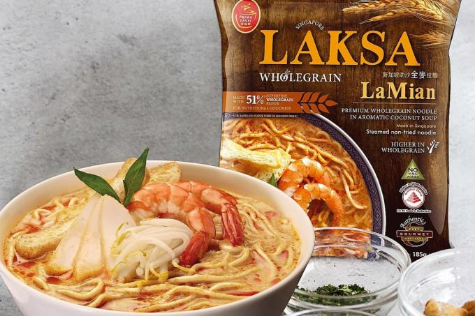

Ramens with the best taste would bring us the best mood of the day! It's time to discover the top-rated ramen and make them on your next menu whether you are busy or not! 


*Image from:* [*tnp*](https://tnp.sg/) Package of **Prime Taste Wholegrain Laksa LaMian**

The table below shows the **NO.1 Ramen** rated on the RAMEN RATER in different years. 

| **Brand**   | **Name**                           | **Style** | **Country** | **year** |
|-------------|------------------------------------|-----------|-------------|----------|
| Prima Taste | Wholegrain Laksa LaMian            | Pack      | Singapore   | 2022     |
| Prima Taste | Wholegrain Laksa LaMian            | Pack      | Singapore   | 2021     |
| Prima Taste | Wholegrain Laksa LaMian            | Pack      | Singapore   | 2020     |
| Prima Taste | Wholegrain Laksa LaMian            | Pack      | Singapore   | 2019     |
| Prima Taste | Singapore Laksa Wholegrain La Mian | Pack      | Singapore   | 2016     |
| MyKuali     | Penang Red Tom Yum Goong Noodle    | Pack      | Malaysia    | 2015     |
| MyKuali     | Penang White Curry Noodle          | Pack      | Malaysia    | 2014     |
| Prima Taste | Singapore Laksa La Mian            | Pack      | Singapore   | 2013     |
| Indomie     | Special Fried Curly Noodle         | Pack      | Indonesia   | 2012     |

<br/>
Singapore clearly wins the game, but what about the performance of the ramen from other countries? We have picked out all ramens that **ranking from 4-5**, to see where our top-rated ramens come from:

```{R, include=TRUE, echo=FALSE, message=FALSE, results='hide', fig.keep='all', warning=FALSE} 
library(readxl)
toprating_country<- read_excel("toprating-country.xlsx")
library(tidyverse)
library(ggplot2)
ggplot(toprating_country, aes(x = reorder(Country, +Ramen), y= Ramen,fill=Ramen))+
     geom_bar(stat="identity", width = 0.5)+
     geom_text(aes(label=Ramen), vjust=0) +
     scale_fill_gradient(low = "yellow", high = "red")+
     labs(x="Country",
          y="Numbers of Ramen", 
          title="Where do ramens ranked>4 from")+ 
     theme_bw()+
     theme(plot.title = element_text(size=22),axis.text.x= element_text(size=12,angle=60),
           axis.text.y= element_text(size=15), axis.title=element_text(size=18)
           )

```

From this bar-graph, we did see that you are very hard to get an unsatisfied ramen! While we also see that Japan, Taiwan, South Korea, and Mainland China are on the list, these countries/regions shared a long history of consuming Ramen, which proved that practice makes the best. 

<br/>

More importantly, let's inspect the performance of different brands.  
Below shows the distribution of our top-rated ramen between different brands, point to different areas to see the number of top-rated ramens they have!

```{r, out.width="100%",include=TRUE, echo=FALSE, message=FALSE, results='hide', fig.keep='all', warning=FALSE}
knitr::include_url("myFile.html", height="540px")
```
This chart only annotated the brands that have more than 10 ramen on the list. Nissin is outstanding among the brands. This may be due to its long history starting from the 1950s and its fantastic tastes.

  

*Image from:* [*NISSIN Group*](https://www.nissin.com/en_jp/about/history/) Classic cup noodel from Nissin
